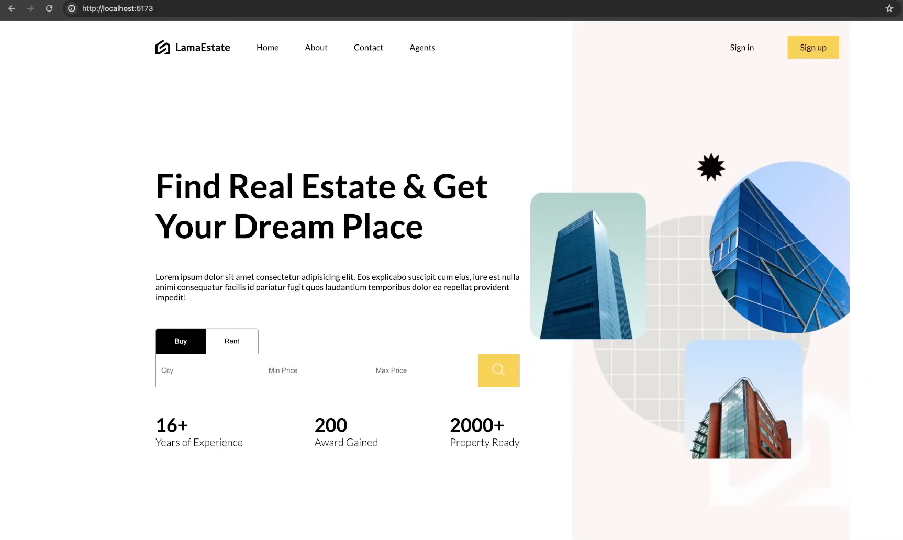
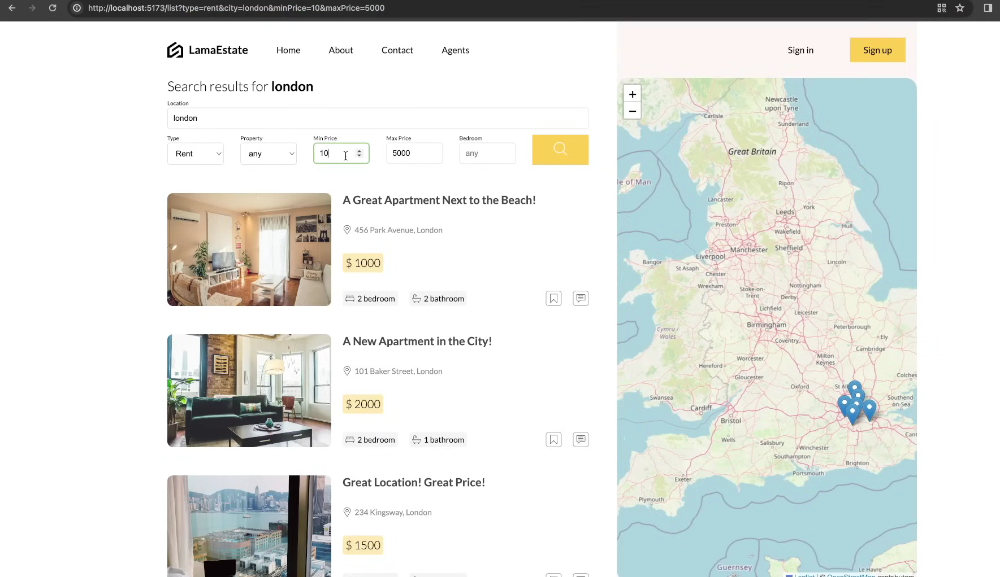
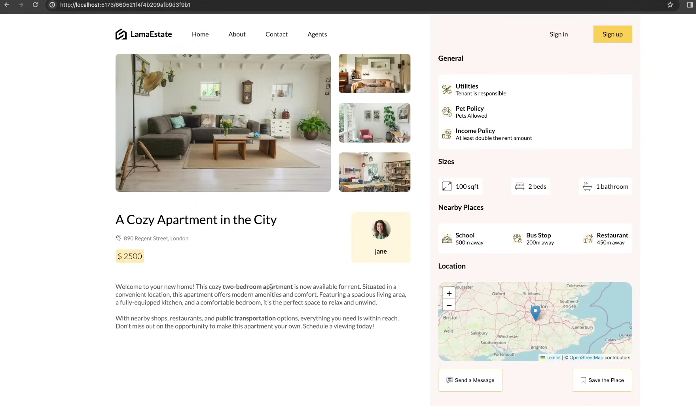
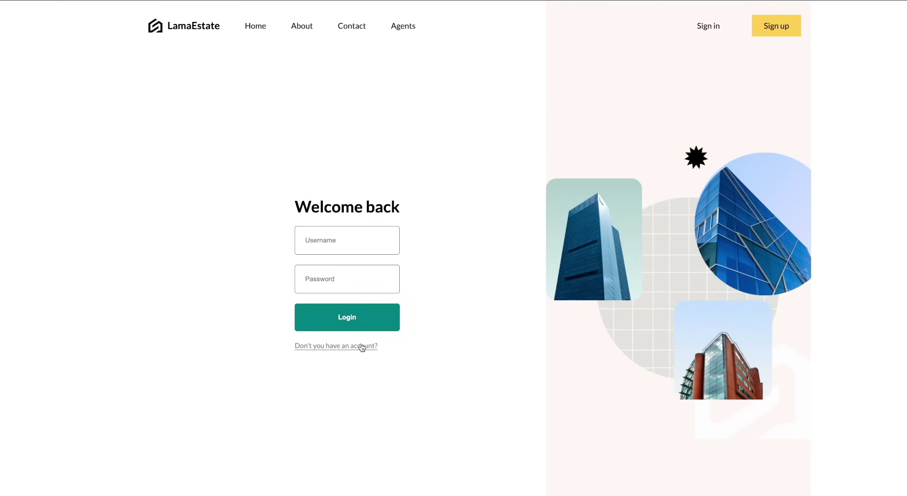
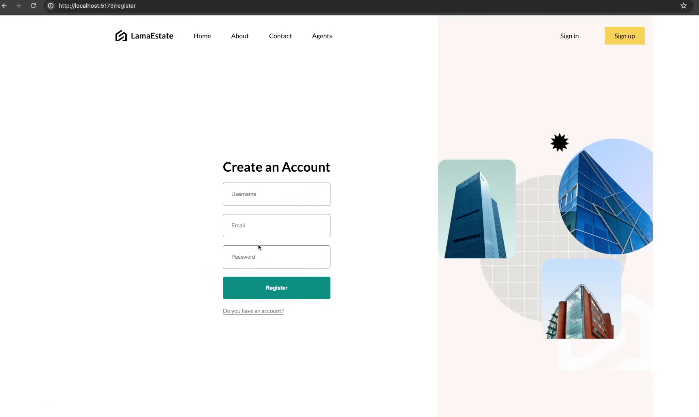
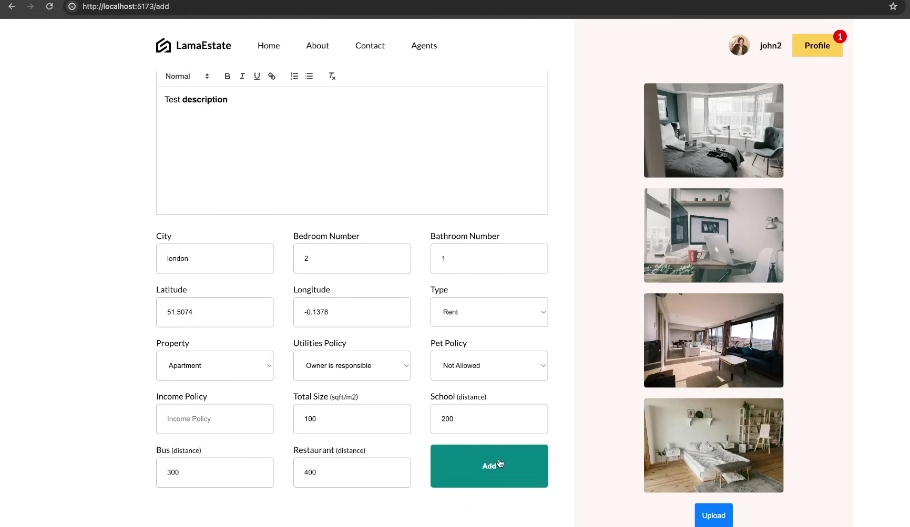
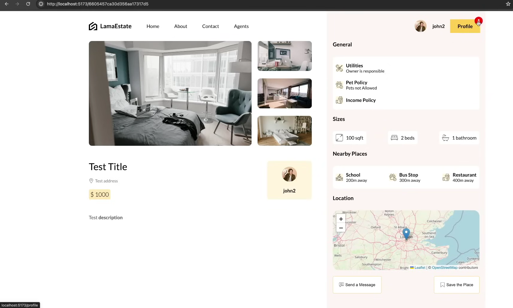
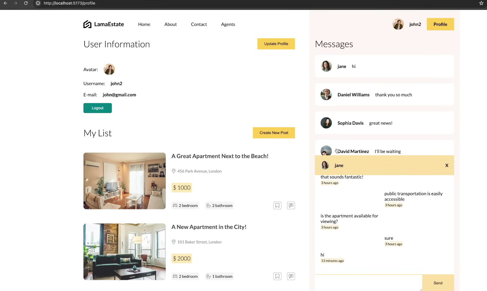

# Find Real Estate And Get Your Dream Place

A **Find Real Estate And Get Your Dream Place** built with **Node.js** and **Express.js**. This platform enables users to search, view, and manage rental properties, communicate with customers, and securely authenticate their accounts.

---

## Table of Contents

- [Features](#features)
- [Screenshots](#screenshots)
- [Installation and Setup](#installation-and-setup)
- [Technologies Used](#technologies-used)
- [Project Structure](#project-structure)
- [Future Enhancements](#future-enhancements)
- [How to Contribute](#how-to-contribute)
- [License](#license)

---

## Features

1. **Search Properties**: Filter properties by location and price range.
2. **Property Details**: View detailed information about rental properties.
3. **User Authentication**: Secure login and registration system.
4. **Create Listings**: Add new rental homes with descriptions and image uploads.
5. **Customer Chat**: Real-time communication with potential customers.

---

## Screenshots

### 1. Home Page  
The home page provides an intuitive interface to filter properties by selecting a location and setting a price range.

  
*Figure: Home page showcasing location filters and price range selection.*

---

### 2. View Rental Homes  
A detailed view of rental homes based on the selected location and price range.

  
  
*Figure: Detailed view of properties filtered by location and price.*

---

### 3. Login Page  
The login page allows users to sign in or register.  

#### 3.1 Already Signed Up  
Users can log in directly if they have an account.

  
*Figure: Login page for registered users.*

#### 3.2 Not Signed Up  
New users can navigate to the registration page.

  
*Figure: Login page with an option to register.*

---

### 4. Create Rental Home Details  
Users can add new rental home listings by filling out details such as location, price, and description. Image uploads are also supported.

 

*Figure: Page to create new rental home listings.*

---

### 5. Chat with Customers  
A real-time chat interface for seamless communication between users and customers regarding property details.

  
*Figure: Chat feature for direct interaction with customers.*

---

## Installation and Setup

Follow these steps to set up the project locally:

1. **Clone the Repository**:
   ```bash
   git clone <repository-url>
